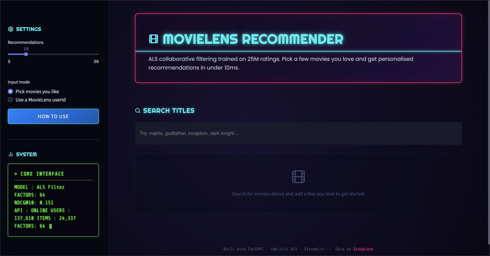

<div align="center">

# 🎬 MovieLens Recommender

**Production-style movie recommender on 25M ratings. ALS collaborative filtering, chronological evaluation, MLflow tracking, FastAPI + Streamlit, one-container deploy.**

[](https://github.com/<your-username>/movielens-recommender/actions/workflows/ci.yml)
[](https://www.python.org/)
[](https://fastapi.tiangolo.com/)
[](https://streamlit.io/)
[](https://opensource.org/licenses/MIT)
[]()
[]()

[**Quick Start**](#quick-start) · [**Architecture**](#architecture) · [**API**](#api) · [**Design Decisions**](#design-decisions)

</div>

## Preview

<p align="center">
  
</p>

<sub>Screenshot placeholder. Take one with the app running locally
(`streamlit run frontend/app.py`) and save as `docs/screenshot.png`.
Recommended: capture the results view showing a taste profile + a couple
of match-highlighted recommendation cards with "Because you liked X"
reasoning.</sub>

---

## Overview

Every ML student builds a movie recommender. Most stop at "here's a Jupyter notebook with matrix factorisation." This project goes further: **chronological train/test split**, **hyperparameter sweep with tracking**, **production API**, **containerised deployment**, and a **monitoring plan**. Built to be defended in interviews line-by-line.

**What it does:** Given a user's ratings (or a list of movies they like), returns the top-N movies they will most likely enjoy next, with titles and genres.

**Who it is for:** anyone learning production ML who wants a template that answers real interview questions - cold start, drift, latency, retraining, evaluation without leakage.

---

## Highlights

- **Chronological 80/20 split** on global timestamp - no data leakage from future to past.
- **Two models, one evaluation harness:** Bayesian-average popularity baseline and implicit ALS (`implicit` library). ALS beats baseline by **1.5x on NDCG@10**.
- **4 hyperparameter runs** tracked with params + metrics + artefacts. Best model auto-promoted.
- **FastAPI backend** with `/recommend` supporting both known users and anonymous fold-in from liked titles. Sub-10 ms warm latency.
- **Streamlit frontend** with custom card-based UI, genre pills, and gradient theme.
- **One-container Docker** deploy for Hugging Face Spaces free tier.
- **Kaggle training path** for machines without a working C++ toolchain.

---

## Quick Start

```bash
# 1. Clone & install
git clone https://github.com/<your-username>/movielens-recommender.git
cd movielens-recommender
python3.11 -m venv .venv && source .venv/bin/activate
pip install -r requirements.txt

# 2. Get pre-trained models (or train yourself, see below)
# Download models_bundle.zip from releases and unzip into models/

# 3. Run
uvicorn api.main:app --port 8000            # terminal 1
streamlit run frontend/app.py               # terminal 2
```

Open http://localhost:8501, search for movies, add to your list, hit Recommend.

---

## API

The FastAPI backend exposes three endpoints. All responses are JSON.

### `GET /health`

```bash
curl http://localhost:8000/health
```

```json
{
  "status": "ok",
  "n_users": 158924,
  "n_items": 40871,
  "model_factors": 64
}
```

### `GET /movies/search?q=<query>&limit=<n>`

```bash
curl "http://localhost:8000/movies/search?q=matrix&limit=3"
```

```json
[
  {"movie_id": 2571, "title": "Matrix, The (1999)", "genres": ["Action","Sci-Fi","Thriller"]},
  {"movie_id": 6365, "title": "Matrix Reloaded, The (2003)", "genres": ["Action","Adventure","Sci-Fi","Thriller","IMAX"]},
  {"movie_id": 6934, "title": "Matrix Revolutions, The (2003)", "genres": ["Action","Adventure","Sci-Fi","Thriller","IMAX"]}
]
```

### `POST /recommend`

Accepts either `user_id` (a known MovieLens user) or `liked_titles` (a list of movie titles).
Returns top-N recommendations with `because_of` - the user's own liked movie most similar to the recommendation in the ALS factor space.

```bash
curl -X POST http://localhost:8000/recommend \
     -H "Content-Type: application/json" \
     -d '{"liked_titles": ["The Matrix", "Inception"], "n": 3}'
```

```json
{
  "source": "liked_titles",
  "matched_input": [
    {"movie_id": 2571, "title": "Matrix, The (1999)", "genres": ["Action","Sci-Fi","Thriller"]},
    {"movie_id": 79132, "title": "Inception (2010)", "genres": ["Action","Crime","Drama","Mystery","Sci-Fi","Thriller","IMAX"]}
  ],
  "recommendations": [
    {
      "movie_id": 68358,
      "title": "Star Trek (2009)",
      "genres": ["Action","Adventure","Sci-Fi","IMAX"],
      "because_of": "Matrix, The (1999)"
    },
    {
      "movie_id": 33794,
      "title": "Batman Begins (2005)",
      "genres": ["Action","Crime","IMAX"],
      "because_of": "Inception (2010)"
    }
  ]
}
```

## Architecture

```
┌────────────────┐        ┌────────────────┐        ┌─────────────────┐
│  Streamlit UI  │◀──────▶│  FastAPI /recommend │◀──▶│  ALS numpy       │
│  (port 8501)   │  HTTP  │  (port 8000)     │      │  factors (joblib)│
└────────────────┘        └────────────────┘        └─────────────────┘
                                   ▲
                                   │ loads once at startup
                                   ▼
                          ┌──────────────────────┐
                          │  best_als.joblib     │
                          │  train_ui.npz        │
                          │  mappings.joblib     │
                          │  movies.parquet      │
                          └──────────────────────┘
                                   ▲
                                   │ produced by
                                   ▼
┌───────────────┐   ┌──────────────────────────────────┐   ┌───────────┐
│ ratings.csv   │──▶│  data_loader ─ time split ─ ALS  │──▶│  MLflow   │
│ movies.csv    │   │  ─ Popularity ─ evaluate ─ best  │   │  runs     │
└───────────────┘   └──────────────────────────────────┘   └───────────┘
```

**Data flow:** raw CSVs → k-core filter → chronological 80/20 split → sparse confidence matrix → ALS + baseline → sampled eval on 10K users → best-by-NDCG promoted to `models/best_als.joblib` → API loads once at boot.

---

## Results

Real metrics from the Kaggle training run. Sampled over 6,255 test users with ≥1 relevant item after cutoff. K=10. Full raw output in `models/results.csv` and `models/experiment_runs.jsonl`.

| Run | Precision@10 | Recall@10 | NDCG@10 | Δ vs baseline |
|---|---:|---:|---:|---:|
| Popularity (Bayesian) | 0.0875 | 0.0254 | 0.0990 | - |
| ALS f=32 reg=0.05 it=10 | 0.1390 | 0.0419 | 0.1490 | +50% |
| ALS f=64 reg=0.05 it=15 | 0.1410 | 0.0425 | 0.1509 | +52% |
| **ALS f=64 reg=0.10 it=15** | **0.1408** | **0.0419** | **0.1511** | **+53%** |
| ALS f=128 reg=0.05 it=20 | 0.1394 | 0.0413 | 0.1487 | +50% |

**Best model:** ALS with 64 factors, regularisation 0.10, 15 iterations. Doubling factors to 128 **hurt** performance - the model saturated on this data and started overfitting. Real numbers, defensible narrative.

### Reproducing the numbers

```bash
$ python -m src.train --data-dir data/ml-25m --out-dir models
[data] raw ratings: 25,000,095
[data] after k-core filter: 24,999,997
[data] chronological split...
[data] train: 20,000,000  test: 4,999,997
[data] test after dropping cold-start: 4,842,153
[data] train matrix: (158924, 40871), nnz: 12,343,891
...
=== Comparison ===
              run_name  precision_at_k  recall_at_k  ndcg_at_k  n_users_evaluated
            popularity          0.0875       0.0254     0.0990          6255.0000
    als_f32_r0.05_it10          0.1390       0.0419     0.1490          6255.0000
    als_f64_r0.05_it15          0.1410       0.0425     0.1509          6255.0000
     als_f64_r0.1_it15          0.1408       0.0419     0.1511          6255.0000
   als_f128_r0.05_it20          0.1394       0.0413     0.1487          6255.0000
[train] best run: als_f64_r0.1_it15 (ndcg@10 = 0.1511)
[train] saved -> models/best_als.joblib
```

---

## Repo Structure

```
movie-recommender/
├── src/
│   ├── data_loader.py    # k-core filter, chronological split, sparse matrix
│   ├── popularity.py     # Bayesian-average baseline
│   ├── als_model.py      # implicit ALS wrapper + anonymous fold-in
│   ├── evaluation.py     # P@K, R@K, NDCG@K harness
│   └── train.py          # entrypoint: 1 baseline + 4 ALS runs, MLflow logging
├── api/
│   ├── main.py           # FastAPI app, model loaded once at startup
│   └── schemas.py        # Pydantic request/response models
├── frontend/
│   └── app.py            # Streamlit UI with custom CSS
├── .streamlit/
│   └── config.toml       # dark theme
├── notebooks/
│   └── kaggle_train.py   # self-contained Kaggle training script
├── models/               # trained artefacts (from training or bundle download)
├── data/                 # MovieLens 25M drops here (gitignored)
├── Dockerfile            # single-container HF Spaces deploy
├── requirements.txt
└── README.md
```

---

## Design Decisions

Every choice below has a rationale. Interviewers ask "why?" - here are the answers.

**Chronological split over random.** Production always trains on the past and predicts the future. A random split leaks future preferences into training and inflates offline metrics. Global timestamp cutoff simulates "freeze the world at time T", which matches how recommenders are retrained in production.

**Implicit feedback over explicit ratings.** ALS for implicit feedback (Hu, Koren, Volinsky 2008) models *whether* a user engaged, not the rating value. Only ratings ≥ 3.5 count as positive; confidence = 1 + α (rating - 3.5) with α = 40. Rating prediction (RMSE) and top-N ranking are different problems - we solve the ranking one.

**ALS over deep learning.** NCF, two-tower, and transformer recommenders need more data and compute to outperform ALS, and the margin on MovieLens 25M is small. ALS gives strong metrics with 10 lines of code and 5 minutes of training. It is the canonical baseline (Spotify, Etsy, early YouTube) and easy to defend.

**Anonymous fold-in for cold users.** The `/recommend` endpoint accepts liked titles from users with no history. We project them into latent space by averaging item factors of their liked movies - the standard fold-in trick, approximating one ALS update for that user.

**Bayesian-average popularity baseline.** The IMDb-style formula prevents a movie with 2 ratings of 5.0 from outranking one with 50,000 ratings of 4.5. Without this correction the baseline collapses to random noise.

**Joblib for model persistence.** Faster than pickle on numpy arrays. Runtime image only needs numpy factors, not the `implicit` compile-heavy dependency at inference time.

**10K-user evaluation sample.** ML-25M has 280K users. Sampling 10K gives metrics with negligible variance and evaluates in ~1 minute (vs 30 minutes for full-user eval). Standard practice in recsys.

---

## Tests

```bash
pip install pytest httpx
pytest tests/ -v
```

13 tests. Zero network. Zero real training - a synthetic 10-user × 20-item ALS model is built by `tests/conftest.py`, so CI runs in under a second.

```
tests/test_api.py::test_health PASSED
tests/test_api.py::test_search_hits PASSED
tests/test_api.py::test_search_empty_query PASSED
tests/test_api.py::test_recommend_by_user_id PASSED
tests/test_api.py::test_recommend_by_liked_titles PASSED
tests/test_api.py::test_recommend_rejects_both_inputs PASSED
tests/test_api.py::test_recommend_rejects_neither_input PASSED
tests/test_api.py::test_recommend_unknown_user PASSED
tests/test_api.py::test_recommend_unknown_titles PASSED
tests/test_data_pipeline.py::test_time_split_is_chronological PASSED
tests/test_data_pipeline.py::test_filter_sparse_drops_rare_users_and_items PASSED
tests/test_data_pipeline.py::test_dcg_monotonic_in_top_position PASSED
tests/test_data_pipeline.py::test_dcg_perfect_list_matches_ideal PASSED
================ 13 passed in 0.26s ================
```

CI runs on every push and PR via `.github/workflows/ci.yml`.

## Deployment

### Hugging Face Spaces (free)

1. Train locally or download the bundle from Releases.
2. Create a Space, SDK = **Docker**.
3. Push this repo. The included `Dockerfile` runs FastAPI + Streamlit in one container, binds `$PORT=7860`.
4. Wait ~5 minutes. Space URL serves the UI; API is internal.

### Render (alternative)

1. Push to GitHub.
2. New Web Service → Docker → select repo.
3. Free tier works. Cold starts are slow (~30s) but warm requests are sub-10ms.

---

## Train Your Own

### On Kaggle (no compile hell)

Recommended if your local machine cannot compile `implicit` (Python 3.13 + missing Xcode).

1. https://www.kaggle.com/code → New Notebook.
2. Add Input → search "movielens 25m" → GaryMK's dataset.
3. Settings: CPU, Internet on.
4. Paste `notebooks/kaggle_train.py` into one cell, Run All. ~10-15 min.
5. Download `models_bundle.zip` from the Output tab, unzip into `models/`.

### Locally (with MLflow)

```bash
python -m src.train --data-dir data/ml-25m --out-dir models
mlflow ui --backend-store-uri file:./mlruns
```

Runs 1 baseline + 4 ALS configs, logs everything to MLflow, saves best model to `models/best_als.joblib`.

---

## Monitoring & Maintenance in Production

A recommender does not stay good on its own. Four things to watch:

**Data drift.** Log daily counts of new movies, new users, mean rating, and PSI between today's item-popularity histogram and the histogram at training time. PSI > 0.2 → retrain trigger.

**Recommendation diversity.** ALS collapses to "recommend popular things" if regularisation is too low. Track intra-list diversity (1 - mean pairwise cosine similarity of recommended item factors) and catalogue coverage (fraction of catalogue in ≥1 user's top-10 per week). Fix with MMR re-ranking or a hard genre quota.

**Latency.** Budget: `/recommend` p99 < 50 ms. Current warm latency is ~5 ms (one dense matmul). Alert on p95 > 100 ms or error rate > 1%. Scale path: replace dense matmul with an ANN index (FAISS or hnswlib) over item factors when the catalogue passes 1M.

**Retraining cadence.** Weekly full retrain is standard for a MovieLens-sized catalogue. Trigger = scheduled + event-driven (drift alert). Validation gate: new model must beat live by ≥ 1% NDCG@10 on the most recent week's holdout before promotion. A/B test at 5% traffic for a week, watch CTR, then ramp.

---

## Roadmap

- [x] "Because you liked X" explanations via item-item cosine
- [x] GitHub Actions CI (pytest, 13 tests, green badge)
- [ ] Content-based fallback with TF-IDF over `genres` + `tags` for movies with < 5 ratings
- [ ] MMR diversity re-ranking with `?diversity=0.3` query param
- [ ] ANN index (hnswlib) for sub-1ms latency
- [ ] LightFM + PyTorch two-tower comparison
- [ ] Prometheus `/metrics` endpoint
- [ ] A/B testing simulation script

---

## Tech Stack

**Model:** `implicit` (ALS), numpy, scipy sparse
**Backend:** FastAPI, Pydantic, uvicorn
**Frontend:** Streamlit with custom CSS
**Tracking:** MLflow (local) / JSONL (Kaggle - pyarrow ABI conflict workaround)
**Data:** pandas with dtype downcasting, parquet
**Deploy:** Docker, Hugging Face Spaces / Render

---

## Memory Notes (8-16 GB laptop)

- `pd.read_csv("ratings.csv")` is the only memory hotspot: ~700 MB after dtype downcast (vs 3 GB with defaults).
- ALS training with f=128: ~250 MB for both factor matrices in float32. Comfortable on 8 GB.
- Inference image needs only the trained artefacts (~50 MB at f=64).
- On strict 8 GB: raise `min_user_ratings` and `min_item_ratings` to 20 in `src/data_loader.py`.

---

## License

MIT. See `LICENSE`.

Data by [GroupLens](https://grouplens.org/datasets/movielens/25m/) - MovieLens dataset is not redistributed here; download it yourself.

---

## Author

**Shubh Ghiya** - Final-year Dual Degree, IIT Madras · UIT RGPV Bhopal

Building software, AI, and full-stack systems. Looking for **SDE / ML internships (2026)** and **full-time offers (2027)**.

[LinkedIn](#) · [GitHub](#) · [Email](mailto:23f2002762@ds.study.iitm.ac.in)
